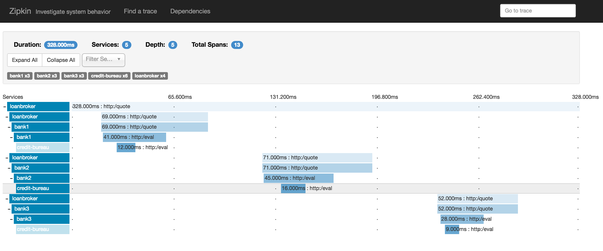

Kubernetes ZipKin
-----------------

The project provides all the required resources to start the required [ZipKin](http://zipkin.io/) components in [Kubernetes](http://kubernetes.io/) and [Openshift](https://www.openshift.com) to trace your microservices.

It has been also tested against [Minikube](https://github.com/kubernetes/minikube) and [Minishift](https://github.com/jimmidyson/minishift).

 

**Table of Contents**

- [Getting Started](#getting-started)
- [Installation](#installation)
    - [Direct Installation](#direct-installation)
    - [Installation using Maven](#installation-using-maven)
        - [Mysql Starter](#mysql-starter)
        - [Minimal Starter](#minimal-starter)
        - [Running the integration tests](#running-the-integration-tests)
- [Using the console](#using-the-console)
    - [Minikube](#minikube)
    - [Minishift](#minishift)
    - [Using port forward](#using-port-forward)
    - [Assigning externally reachable URLs](#assigning-externally-reachable-urls)
- [Prometheus Integration](#prometheus-integration)
- [Community](#community)
    - [Zipkin](#zipkin)
    - [Kubernetes](#kubernetes)
    - [Fabric8](#fabric8)

### Getting Started

To install ZipKin in kubernetes you need to create the deployment and services that corresponds to the ZipKin components and their requirements.

There are 2 ways of doing that:

-   Direct installation
-   Generating and installing via Maven

### Installation

#### Direct installation

To directly install everything you need:

    kubectl create -f http://repo1.maven.org/maven2/io/fabric8/zipkin/zipkin-starter/0.1.5/zipkin-starter-0.1.5-kubernetes.yml

or if you are using openshift:

    oc create -f http://repo1.maven.org/maven2/io/fabric8/zipkin/zipkin-starter/0.1.5/zipkin-starter-0.1.5-openshift.yml

To directly install a minimal ZipKin *(just storage and query)*:

    kubectl create -f http://repo1.maven.org/maven2/io/fabric8/zipkin/zipkin-starter-minimal/0.1.5/zipkin-starter-minimal-0.1.5-kubernetes.yml

or if you are using openshift:

    oc create -f http://repo1.maven.org/maven2/io/fabric8/zipkin/zipkin-starter-minimal/0.1.5/zipkin-starter-minimal-0.1.5-openshift.yml

Both of the above are released in json format too.

Zipkin uses a storage backend (it can be mysql, cassandra or elastic search, but currently this project only supports mysql). The storage requires a persistence volume.
So the next step is to create it. So you either need to create a persistence volume named `mysql-data`.

Or if you are using [gofabric8](https://github.com/fabric8io/gofabric8), it can automatically create it for you:

    gofabric8 volumes

#### Installation using Maven

The configuration that was downloaded from the internet in the previous step can also be generated using the starter modules.
The starter module are plain maven projects that generate and apply kubernetes/openshift configuration using the [Fabric8 Maven Plugin](http://fabric8.io/guide/mavenPlugin.html)

Currently the available starters are:

-   starter-mysql
-   starter-minimal

##### MySQL Starter

The mysql starter will generate and install Zipkin using MySQL as a storage module.

    mvn clean install
    mvn fabric8:deploy -pl starter-mysql

The first command will build the whole project and the second will apply the resources to kubernetes (including its dependencies).
So after using the above in a clean workspace, your workspace should look like this:

    kubectl get pods

NAME | READY|STATUS|RESTARTS|AGE
-----|------|------|--------|---
kafka-qw13r|1/1|Running|0|8m
zipkin-mysql-ygm1g|1/1|Running|0|8m
zipkin-roxae|1/1|Running|0|8m
zookeeper-1-my183|1/1|Running|0|8m
zookeeper-2-jx8eq|1/1|Running|0|8m
zookeeper-3-d1icz|1/1|Running|0|8m

##### Minimal Starter

The minimal starter will generate and install a Zipkin without a collector and using MySQL as a storage module. This can be also "considered" a dev mode.

    mvn clean install
    mvn fabric8:deploy -pl starter-minimal

This time kafka and zookeeper will not be installed at all.

NAME | READY|STATUS|RESTARTS|AGE
-----|------|------|--------|---
zipkin-mysql-d4msa|1/1|Running|0|8m
zipkin-rpxfw|1/1|Running|0|8m

### Running the integration tests

Some really basic integration tests have been added. The purpose of those tests is to check that configuration and images are working.
The integration tests are based on [Fabric8 Arquillian](http://fabric8.io/guide/testing.html) and require an existing Kubernetes/Openshift environment.
So they are disabled by default. To enabled and run them:

    mvn clean install -Dk8s.skip.test=false

### Using the console

Once the zipkin pod is ready, you will be able to access the console using the zipkin service.

Depending on the Kubernetes flavor, cloud provider etc, the way to access the console may vary, but for dev time, this should work:

    
#### Minikube    

With minikube you can just use:

    minikube service zipkin

and the console should pop right up in your browser.

#### Minishift

Similarly with minishift:

    minishift service zipkin

#### Using port forward

A more generic approach that should work everywhere is, using port forwarding.

You can grab the list of pods and detect the zipkin pod:
    
    kubectl get pods

It should be something like:
    
    zipkin-1623767123-g3j00       1/1       Running   1          1d
    
Then you can use port-forward so that you can access the service locally.
    
    kubectl port-forward zipkin-1623767123-g3j00 9411 9411
    
or if I'd like to use a random local port:
    
    kubectl port-forward zipkin-1623767123-g3j00 :9411    

#### Assigning externally reachable URLs

To see how can assign externally reachable url to Kubernetes services, you may want to have a look at [Ingress](https://kubernetes.io/docs/user-guide/ingress/).

Or for Openshift services, you may want to have a look at [Routes](https://docs.openshift.com/enterprise/3.0/architecture/core_concepts/routes.html).

### Prometheus integration

As of 0.1.5 kubernetes-zipkin comes with prometheus annotations, so that the the zipkin server is monitored by prometheus.
You can easily try out this feature by installing prometheus:

    kubectl create -f http://repo1.maven.org/maven2/io/fabric8/devops/apps/prometheus/2.2.259/prometheus-2.2.259-kubernetes.yml

or on openshift:

    oc create -f http://repo1.maven.org/maven2/io/fabric8/devops/apps/prometheus/2.2.259/prometheus-2.2.259-openshift.yml

### Community

If you want to get involved, get help or contribute, please find below some useful links 

#### Zipkin

Some useful links:

- [Zipkin Organization on Github](https://github.com/openzipkin)
- [Zipkin channel on Gitter](https://gitter.im/openzipkin/zipkin)

#### Kubernetes

- [Kubernetes Organization on Github](https://github.com/kubernetes)
- [Kubernetes Community Page](https://kubernetes.io/community/)
- [Kubernetes on Slack](http://slack.k8s.io/)

#### Fabric8

- [Fabric8 Organization on Github](https://github.com/fabric8io)
- [Fabric8 Community Page](http://fabric8.io/community/)
